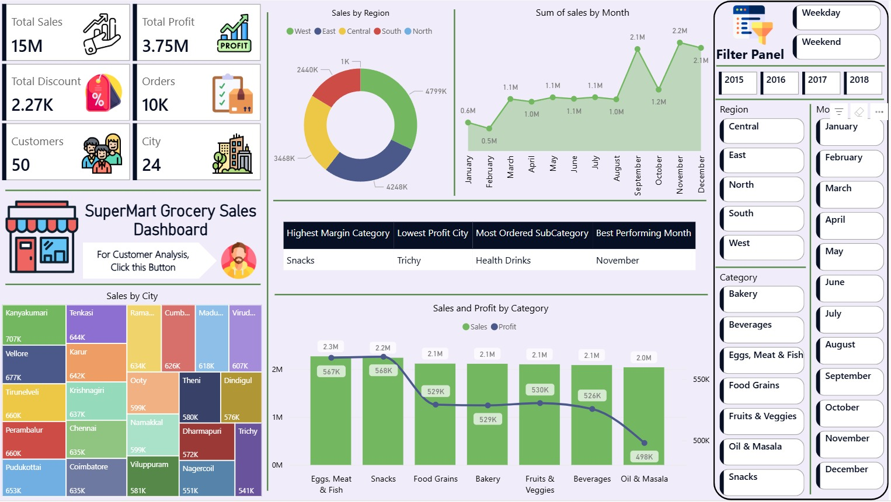
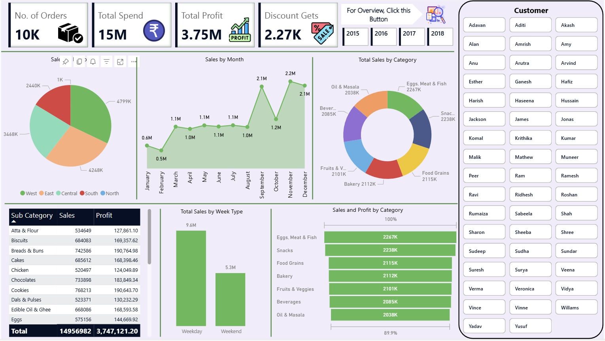

# 🛒 SuperMart Grocery Sales Dashboard - Power BI Project

## 📌 Project Overview
The **SuperMart Grocery Sales Dashboard** is a comprehensive Power BI solution designed to analyze and visualize sales, profit, discounts, orders, and customer data across various cities, regions, and categories.

This dashboard provides deep insights into:
- Top performing cities and product categories
- Profit margins by region and category
- Trends over time (monthly & weekly sales)
- Customer segmentation and order behavior

---

## 📊 Key Features

- **Interactive Filters**:
  - Year selection (2015–2018)
  - Region, Month, Category, and Customer filters
  - Weekday vs Weekend toggle

- **Visual Insights**:
  - KPI tiles for Total Sales, Profit, Discounts, Orders, etc.
  - Monthly sales line chart
  - Region-wise and Category-wise donut charts
  - Treemap of Sales by City
  - Bar and combo charts for category performance
  - Customer panel for segmentation

- **Insight Summary Cards**:
  - Highest Margin Category
  - Lowest Profit City
  - Most Ordered Subcategory
  - Best Performing Month

---

## 🧩 Tools Used

| Tool      | Purpose                     |
|-----------|-----------------------------|
| Power BI  | Data visualization & report |
| Excel     | Data source preprocessing   |

---

## ✅ How to Run

1. Clone or download the project folder.
2. Open `SuperMart Grocery Sales Dashboard.pbix` in Power BI Desktop.
3. Make sure the Excel source is connected properly under `Transform Data`.
4. Apply filters and explore the visuals interactively.

---

## 📈 Use Cases

- Business performance tracking
- Regional performance benchmarking
- Customer and product analysis
- Marketing campaign planning

---

## 🙋🏻‍♂️ Created By

**Ritesh Zambare**  
B.E. Information Technology (Mumbai University)  
Aspiring Data Scientist | Power BI Enthusiast  

---

## 📷 Dashboard Preview

### Dashboard View 1  

### Dashboard View 2  

---

## 📬 Contact

For any questions or feedback, feel free to reach out:  
📧 Email: `riteshrzambare1234@gmail.com`  
🌐 LinkedIn: [linkedin.com/in/riteshzambare](https://www.linkedin.com/in/ritesh-zambare-0265032b0/)

